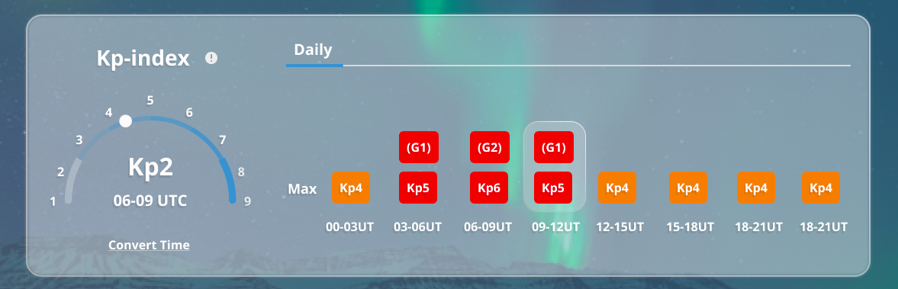
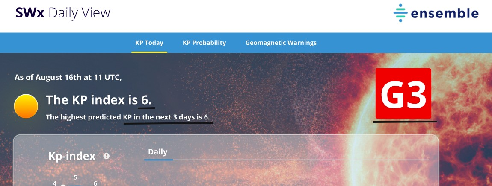
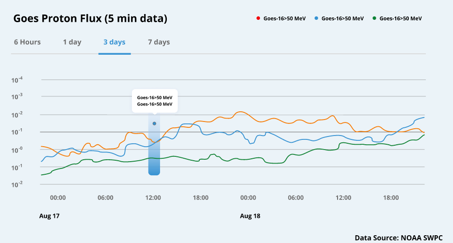
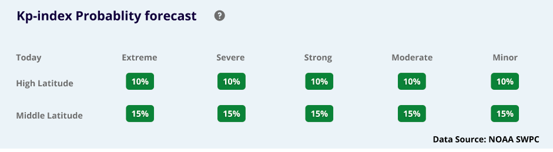

# SWx Daily View

[](https://www.python.org/)

## Clone Project
```console
git clone https://github.com/EnsembleGovServices/swxdailyview.git

OR 

git clone git@github.com:EnsembleGovServices/swxdailyview.git
```
Current updated code is in `dev` branch. To change branch `git checkout dev`.

## Install requirements.txt
```console
pip install -r requirements.txt
```

## Add Configurations to `.env` file in root directory.
```console
ACCESS_KEY=YOUR_AWS_ACCESS_KEY
SECRET_KEY=YOUR_AWS_SECRET_KEY
BUCKET_NAME =YOUR_AWS_S3_BUCKET_NAME
FLASK_ENV=YOUR_EX_DEVELOPMENT
DNS_FOR_SENTRY=YOUR_SENTRY_DNS_LINK
TEST_ENV = YOUR_ENVIRONMENT_NAME_FOR_TESTING
REDIS_HOST = YOUR_REDIS_HOST_DATA
REDIS_PORT = YOUR_REDIS_PORT_NUMBER
REDIS_DB = YOUR_REDIS_DB_DATA
CACHE_TYPE= YOUR_FLASK_CACHE_TYPE
```
## Project Structure
This is the folder/file structure we have.
```
/main-project-directory
|
├── application.py
|
├── /Swx_Daily_View_Project
│   ├── __init__.py            ---------------> Declared Application Factory         
│   ├── constants.py           ---------------> Declared All needed constants here
│   ├── languages.py           ---------------> Handle Request and Response
│   ├── s3_services.py         ---------------> Handle s3 buckets client and bucket services 
|   |
│   └── /goes_proton_flux
│   │   ├── __init__.py
│   │   ├── resources.py           ---------------> Api Endpoints
│   │   ├── routes.py              ---------------> Api Endpoints
│   │   ├── services.py            ---------------> Intermediate Layer( All other layer's communication must happen via this layer)
│   │   └── utils.py               ---------------> Common function which is used repeadately declared here
|   |
│   └── /kp_forecast
|   │   ├── __init__.py
│   │   ├── resources.py           ---------------> Api Endpoints
│   │   ├── routes.py              ---------------> Api Endpoints
│   │   ├── services.py            ---------------> Intermediate Layer( All other layer's communication must happen via this layer)
│   │   └── utils.py               ---------------> Common function which is used repeadately declared here
|   |
│   └── /latitude_index
|   │   ├── __init__.py
│   │   ├── resources.py           ---------------> Api Endpoints
│   │   ├── routes.py              ---------------> Api Endpoints
│   │   ├── services.py            ---------------> Intermediate Layer( All other layer's communication must happen via this layer)
│   │   └── utils.py               ---------------> Common function which is used repeadately declared here
|   
├── .env-example  or .env          ---------------> Required configuartion(Development, Production etc.) 
├── .gitignore                     ---------------> Listing all files/folders to ignore in git commits   
├── config.py                      ---------------> Required configuartion(Development, Production etc.) 
├── README.md                      ---------------> Documentation on project code
├── requirements.txt               ---------------> Required Packages and Third party libraries
└── /tests                         ---------------> For testing the project code [ test-cases ]
```


# Overview of project structure

Root folder main-project-directory that contains the project specific file under Swx_Daily_View_Project
directory and the files like requirements.txt, .gitignore, .env, etc.

#### Swx_Daily_View_Project

*1. \_\_init__.py*
* Configure Application Factory.
    * Create a Flask app object, Configure app object using config file
    * Initialize plugins which is globally accessible
    * Imported routes and register Blueprints


*2. language.py(langauge layer file)*
* This layer can only communicate with the service layer.
    * It Processes the client request APIs data and serialize data(if required) and send response according to the requirement to the client.
    * For example, convert response data according to  success/fail response etc.This all kind
      of methods we can perform in this layer.

*3. constants.py*
- All App level constants are defined in here, right now we preferred to put all string constants in the single file so if we need to do multilingual app it can be useful to have all strings in single place.

### Module folders [folder/s]
* All the modules(app) must have their own package which works as an abstraction for itself.In this project has 3 modules(app)
    1. Goes Proton Flux Module
       -- It contains Goes Proton Flux related APIs [ includes get proton flux interval wise data we have 4 intervals 6 hours, 1 day, 3 days and 7 days ]
  
    2. Kp Forcast Module
       -- It contains Kp forecast related APIs. [ includes fetch current kp index, highest predicted from next 3 days kp index value, and particular date's interval kp index's values ]
  
    3. Latitude Index Module -- It contains middle and high latitude APIs
  
    * For bigger projects, all our code shouldn't be in the same file. Instead, we can segment or split bigger codes into separate files, mostly based on functionality. Like bricks forming a wall.
    * For This purpose here we are using blueprints.


# *Module level files*

* It's best practice to have internal dependency and calling hierarchy like below.
    * Module(app) can have some layers as per the requirements.

## 1. Views Layer:

### *routes.py*
* This file code should be just having the API end points and nothing else.
    * It's only responsibility is to have all the routes for that module.
    * This file can only interact with services.py.

## 2. Service Layer:
### *services.py*
* This file is kind of act as mediator between views and all other layers.

## 3. Language Layer:
### *languages.py*
* In this project , it's not required to create language.py at module level , but if required ww need to create it.

## 4. utils.py:
* Here we need to define extra utilities.
    * Here we define functions which might repeatedly used in python package.

## Files at root level
*1. config.py*
- This File is responsible for extracting variable value for .env file and assign to
  configuration variable according to requirements(like development, production etc.)

*2.requirements.txt*
* All required packages

*3. .env*
* It contains all SECRET and sensitive variables
* .env-example is the demo for creation the .env file

*4.application.py*
* Entry point of our project.

## Description: [ includes purpose & meaning ]
## NOTE
    Before using any endpoint we have one request query parameter

    named as time_stamp

    time_stamp --> The Unix epoch (or Unix time or POSIX time or Unix timestamp) is the number of seconds that have elapsed since January 1, 1970 (midnight UTC/GMT)
    
    for example: 
    time_stamp: 1665464364
    which is based on location and time_zone

    {
        "countryCode": "US",
        "countryName": "United States",
        "zoneName": "America/Anchorage",
        "gmtOffset": -28800,
        "timestamp": 1665464364
    }

    human redable conversion as below:

    for time_stamp: 1665464364

    Supports Unix timestamps in seconds, milliseconds, microseconds and nanoseconds.
    Assuming that this timestamp is in seconds:
    GMT: Tuesday, 11 October 2022 04:59:24
    Your time zone: Tuesday, 11 October 2022 10:29:24 GMT+05:30
    Relative: 8 hours ago

## Main 3 modules

- KP Forecast Data
- Goes Proton Flux Data
- Latitude Index Data


## Module #1 KP Forecast Data

#### KP Forecast Data
In this we have 3 endpoints

```http
GET /current-kp-index
GET /get-interval-kp-data
GET /predicted-kp-index
```
- Current Kp Index
```http
GET /current-kp-index
```

[ will returns kp_index rate with it's noaa_scale value depends on time_stamp it'll give that day's data. ]

note: Most of the time purpose is to use for current date's data, so it will return current kp_index rate (most occurrence kp_index rate for that day.) and noaa_scale value accordingly.

noaa_scale [ G1,G2,G3,G4,G5] only occurs if kp_index value is higher or equals to 5.

- Get interval kp data
```http
GET /get-interval-kp-data
```
This will be going to return the interval kp_index rates and the intervals must be [00-03,03-06,06-09,09-12,12-15,15-18,18-21,21-00] with their respective kp_index and noaa_scale values
- This is how we use this get-interval-kp-data in application as below.

- Get Predicted kp-index
```http
GET /predicted-kp-index/get-interval-kp-data
```
This end-point will return the highest predicted kp_index for the next 3 days from the desired date with its respective noaa_scale value.

| Parameter    | Type     | Description                                |
|:-------------|:---------|:-------------------------------------------|
| `time_stamp` | `string` | **Required**. Unix time (current location) |


- You can see 6 as current kp_index value corresponding noaa_scale value is G3. and at last we have used predicted kp_index for next 3 days. 
## Module #2 Goes Proton Flux Data

We have 1 endpoint

```http
GET /get-proton-flux-data
```

--> which gives the proton flux data in 4 major intervals

- 6 hours Goes Proton Flux data

| Parameter    | Type     | Description                                 |
|:-------------|:---------|:--------------------------------------------|
| `time_stamp` | `string` | **Required**. Unix time (current location)  |
| `hours`      | `string` | **Required**. Always 6 [ as per requested ] |

- 1 day Goes Proton Flux data

| Parameter    | Type     | Description                                   |
|:-------------|:---------|:----------------------------------------------|
| `time_stamp` | `string` | **Required**. Unix time (current location)    |
| `days`       | `string` | **Required**. input--> 1 [ as per requested ] |

- 3 days Goes Proton Flux data

| Parameter    | Type     | Description                                   |
|:-------------|:---------|:----------------------------------------------|
| `time_stamp` | `string` | **Required**. Unix time (current location)    |
| `days`       | `string` | **Required**. input--> 3 [ as per requested ] |

- 7 days Goes Proton Flux data

| Parameter    | Type     | Description                                   |
|:-------------|:---------|:----------------------------------------------|
| `time_stamp` | `string` | **Required**. Unix time (current location)    |
| `days`       | `string` | **Required**. input--> 7 [ as per requested ] |

with 3 respective groups gt_10, gt_50 and gt_100 with their time_tag and flux values.

- here you can clearly see that we have graphical requirement for 6 hours, 1 day, 3 & 7 days.

## Module #3 Latitude Index Data

- We have 2 endpoints

```html
GET /get-mid-latitude
GET /get-high-latitude
```

| Parameter    | Type     | Description                                |
|:-------------|:---------|:-------------------------------------------|
| `time_stamp` | `string` | **Required**. Unix time (current location) |

- Both endpoint will return noaa_scale prediction percentage

- categories are divided as below


    {
    "minor": G1 --> if kp_index value is >5,
    
    "moderate": G2 --> if kp_index value is >6,
    
    "strong": G3 --> if kp_index value is >7,
    
    "severe": G4 --> if kp_index value is >8,
    
    "extreme": G5 --> if kp_index value is >9
    }


- Here we have high and middle latitude's percentage wise outputs. 